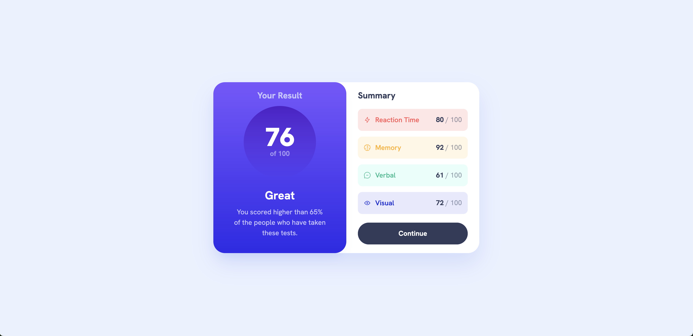

# Frontend Mentor - Results summary component solution

This is a solution to the [Results summary component challenge on Frontend Mentor](https://www.frontendmentor.io/challenges/results-summary-component-CE_K6s0maV). Frontend Mentor challenges help you improve your coding skills by building realistic projects.

## Table of contents

- [Overview](#overview)
  - [The challenge](#the-challenge)
  - [Screenshot](#screenshot)
  - [Links](#links)
- [My process](#my-process)
  - [Built with](#built-with)
  - [What I learned](#what-i-learned)
  - [Continued development](#continued-development)
- [Author](#author)

## Overview

### The challenge

Users should be able to:

- View the optimal layout for the interface depending on their device's screen size
- See hover and focus states for all interactive elements on the page
- **Bonus**: Use the local JSON data to dynamically populate the content

### Screenshot



### Links

- [Solution](https://www.frontendmentor.io/solutions/results-summary-NgZOQRyzjn)
- [Live Site](https://theosaurus-rex.github.io/results-summary-component/)

## My process

### Built with

- Semantic HTML5 markup
- Flexbox
- CSS Grid
- Mobile-first workflow

### What I learned

When adding a transition animation to an element that has a background gradient, animations do not apply smoothly when simply adding the `transition` property. In order to get a smooth animation between the solid and gradient background colours, I added a pseudo-element to overlay the button instead, and then handled the visibility with an animation instead:

```css
.summary__button {
  background-image: linear-gradient(
    var(--color-light-slate-blue),
    var(--color-light-royal-blue)
  );
  position: relative;
  z-index: 1;
  transition: background-image 0.3s ease;
  /* ...other styles */
}
.summary__button::before {
  content: "";
  position: absolute;
  top: 0;
  left: 0;
  right: 0;
  bottom: 0;
  background-color: var(--color-dark-gray-blue);
  border-radius: inherit;
  z-index: -1;
  transition: opacity 0.3s ease;
}

.summary__button:hover::before {
  opacity: 0;
}
```

### Continued development

When I have time, I plan to come back and dynamically populate the data using the provided JSON file.

## Author

- Website - [Theo Harris](https://theo-harris-dev.com/)
- Frontend Mentor - [@Theosaurus-Rex](https://www.frontendmentor.io/profile/Theosaurus-Rex)
- Bluesky - [@theosaurus-rex.bsky.social](https://bsky.app/profile/theosaurus-rex.bsky.social)
